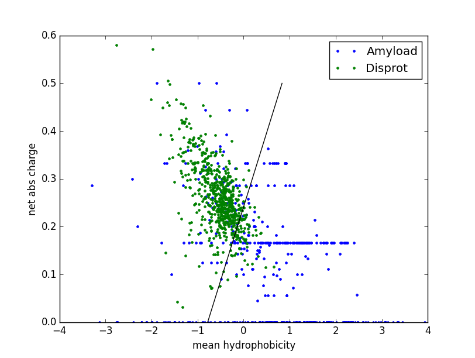
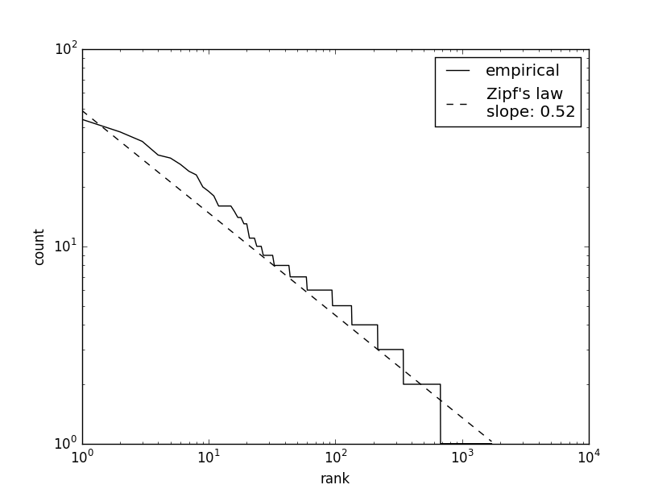
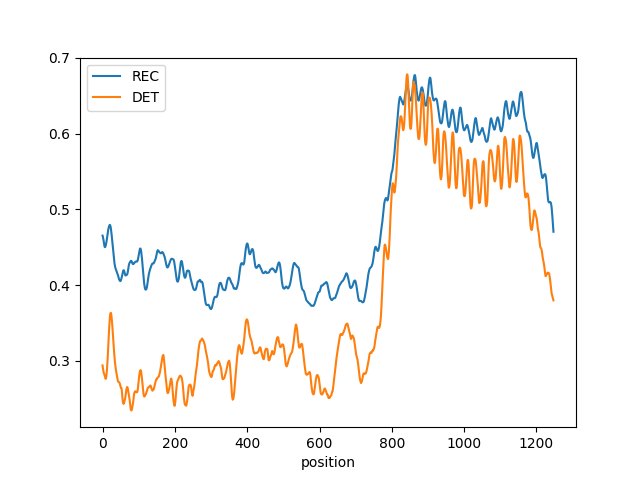
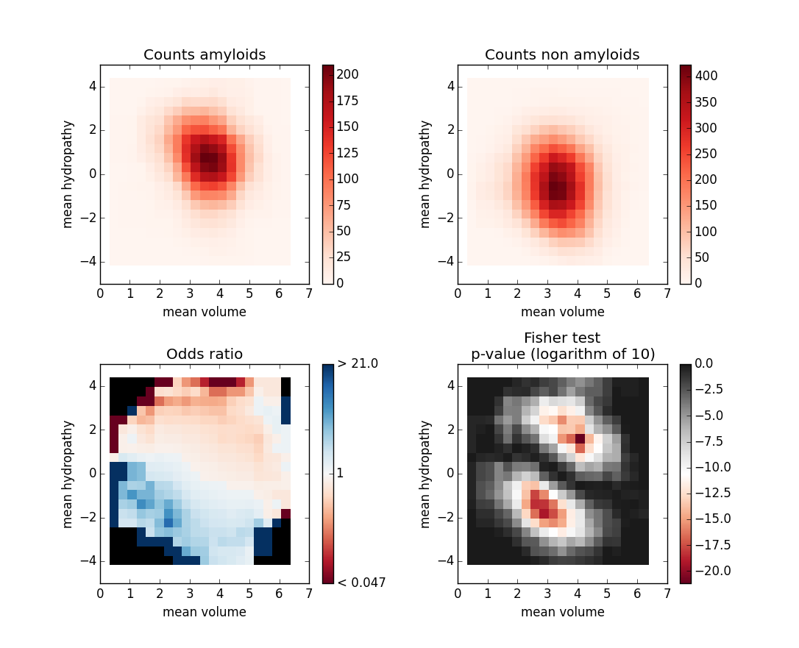

# The Quantiprot package

## Introduction

The Quantiprot package is a python package designed to facilitate quantitative analysis of protein sequences. The package facilitates conversion from sequences of amino acids to sequences of quantitative properties, such as charge, hydrophobicity, and more than 500 other properties available in the AAindex database (Kawashima et al. 1999). Raw and converted protein sequences can be quantified and analyzed in a user-defined multidimensional space of numeric features. Currently implemented features ranges from basic measures such as property average and sum, through more sophisticated ones such as entropy or pattern count, to recurrence and determinism used in the recurrence quantitative analysis. Moreover, it is easy to implement an own metric. In addition to quantifying a sequence with a single value, it is possible to calculate sequence profiles using the sliding window. Quantiprot also implements advanced analyses of protein sequences: it calculates n-gram frequencies and verifies their compliance with the Zipf’s law, and compares sequence sets performing local Fisher's exact tests in a two-dimensional feature space. 

## Requirements

Quantiprot is written in python 2.7. The only requirement for the vast majority of functionalities is `numpy`. The full requirements include also `matplotlib`, `powerlaw`, `requests`, and `scipy`.  More specifically, `requests` is required for accessing the AAindex database online (while the flat file is distributed with the package), `powerlaw` is required for power law fitting of the n-gram distribution, `scipy.stats` is required for calculating the Fisher's exact test, and `matplotlib` is required for visualizing analyses.

## Functionalities


* Sequence set manipulation
  * Read sequences from a FASTA file,
  * Add a sequence to a sequence set,
  * Access a sequence in a sequence set,
  * Merge sequence sets,
  * Make a subset of sequences,
  * Extract selected columns from a sequence set,
  * Compact multiple single-value features.


* Sequence conversion
  * Define a mapping from amino acids to arbitrary properties,
  * Import a mapping from the AAindex database,
  * Simplify / "discretize" the mapping with user-defined thresholds / centroids, or with linear, even-percentile or k-means clustering into k-levels, and label with ordered integers: i, i+1, …, i+k, mean values (cluster centroids), or user-defined labels e.g. [‘low’, ’medium’, ‘high’],
  * Convert sequences using a mapping.
 

* Sequence quantification
  * Quantify a sequence using a selected measures,
  * Calculate a quantitative profile of a sequence using a sliding window.


* Quantification measures
  * Total sum of absolute values,
  * Average value, and average value of absolute values,
  * Count and frequency of a given value,
  * Number of unique elements, and number of unique elements over sequence length,
  * Entropy,
  * Count, frequency and matches of a given pattern,
  * Recurrence, determinism and palindromism.


* Power-law fitting
  * Fit a power-law distribution to n-gram frequency distribution


* Feature space exploration
  * Compare two sequence sets in a discretized 2d space using the Fisher's exact test with the null hypothesis that the ratio of cardinalities in a given part of the space is equal to overall ratio.


## Quick start
Read in a set of sequences from a fasta file, calculate the average polarity index values and export the data.
```
from quantiprot.utils.io import load_fasta_file
from quantiprot.utils.feature import Feature, FeatureSet
from quantiprot.metrics.aaindex import get_aaindex_file
from quantiprot.metrics.basic import average

# Load data:
seq = load_fasta_file("data/Alphasyn.fasta")

# Build a feature: average polarity (Grantham, 1974), AAindex entry: GRAR740102:
feat = Feature(get_aaindex_file("GRAR740102")).then(average)

# Add the feature to new feature set:
fs = FeatureSet("my set")
fs.add(feat)

# Process sequences:
res_seq = fs(seq)

# Export average polarities
res = res_seq.columns()
print res
```
```
[[8.161111111111111, 8.16111111111111, 7.75625, 8.484615384615385, 7.477777777777778]]
```

## Examples
### Basic sequence manipulation
```
from quantiprot.utils.io import load_fasta_file
from quantiprot.utils.sequence import SequenceSet
from quantiprot.utils.sequence import merge
```
#### Read and display protein sequences from a fasta file

```
# Load protein sequences from 'data/Amyload_positive.fasta':
amyload_pos_seq = load_fasta_file("data/Amyload_positive.fasta")

# Display first three sequences:
print amyload_pos_seq
for seq in amyload_pos_seq[:3]:
    print seq
```
```
Quantiprot SequenceSet object
  'name': data/Amyload_positive.fasta
  'unique': True
  number of sequences: 443
Quantiprot Sequence object
  'identifier': AMY1|K19|T-Protein_(Tau)
  'feature': fasta
  'data': ['P', 'G', 'G', 'G', 'K', 'V', 'Q', 'I', 'V', 'Y', 'K', 'P', 'V']
Quantiprot Sequence object
  'identifier': AMY9|K19Gluc41|T-Protein_(Tau)
  'feature': fasta
  'data': ['N', 'L', 'K', 'H', 'Q', 'P', 'G', 'G', 'G', 'K', 'V', 'Q', 'I', 'V', 'Y', 'K', 'P', 'V', 'D', 'L', 'S', 'K', 'V', 'T', 'S', 'K', 'C', 'G', 'S', 'L', 'G', 'N', 'I', 'H', 'H', 'K', 'P', 'G', 'G', 'G', 'Q', 'V', 'E']
Quantiprot Sequence object
  'identifier': AMY14|K19Gluc782|T-Protein_(Tau)
  'feature': fasta
  'data': ['N', 'L', 'K', 'H', 'Q', 'P', 'G', 'G', 'G', 'K', 'V', 'Q', 'I', 'V', 'Y', 'K', 'E', 'V', 'D']
```
 
Note the `SequenceSet.unique` attribute which is set to `True` by default to prevent from adding sequences whose `identifier` _and_ `feature` attributes are already present in the sequence set.

#### Find and copy a sequence to new sequence set
```
# Find a sequence 'AMY438|7-13|Sup35' in 'amyload_pos_seq':
my_seq_index = amyload_pos_seq.ids().index("AMY438|7-13|Sup35")
my_seq = amyload_pos_seq[my_seq_index]
print my_seq

# And copy the sequence to a new sequence set:
my_seq_set = SequenceSet("my seq set")
my_seq_set.add(my_seq)
print my_seq_set
```
```
Quantiprot Sequence object
  'identifier': AMY438|7-13|Sup35
  'feature': fasta
  'data': ['G', 'N', 'N', 'Q', 'Q', 'N', 'Y']
Quantiprot SequenceSet object
  'name': my seq set
  'unique': True
  number of sequences: 1
```
Note that `SequenceSet.ids()` returns the list of identifiers of all sequences.

```
# Try again to add the same sequence to 'my_seq_set' with 'unique' = True:
my_seq_set.add(my_seq)
print my_seq_set
```
```
Quantiprot SequenceSet object
  'name': my seq set
  'unique': True
  number of sequences: 1
```

#### Merge two sequence sets
```
# Load another sequence sets:
amyload_neg_seq = load_fasta_file("data/Amyload_negative.fasta")
print amyload_neg_seq

# And merge with 'amyload_pos_seq'
amyload_merged_seq = merge(amyload_pos_seq, amyload_neg_seq)
print amyload_merged_seq

```
```
Quantiprot SequenceSet object
  'name': data/Amyload_negative.fasta
  'unique': True
  number of sequences: 1037
Quantiprot SequenceSet object
  'name': data/Amyload_positive.fasta+data/Amyload_negative.fasta
  'unique': True
  number of sequences: 1480
```
```
# Sometimes it is more convenient to merge in-place
# Here we perform two consequent mergings:
# 1) 'my_seq_set' with 'amyload_pos_seq'
# 2) the resulting set with 'amyload_neg_seq'

my_seq_set.merge_with(amyload_pos_seq).merge_with(amyload_neg_seq)
print my_seq_set
```
```
Quantiprot SequenceSet object
  'name': my seq set
  'unique': True
  number of sequences: 1480
```


### Conversions
Let's set up the work bench:
```
from quantiprot.utils.io import load_fasta_file
from quantiprot.utils.sequence import SequenceSet
from quantiprot.utils.sequence import subset, columns
from quantiprot.utils.feature import Feature, FeatureSet

# Conversions-related imports:
from quantiprot.utils.mapping import simplify
from quantiprot.metrics.aaindex import get_aa2charge, get_aa2hydropathy
from quantiprot.metrics.aaindex import get_aaindex_file
from quantiprot.metrics.basic import identity

# Load the 'data/Alphasyn.fasta' sequence set, which contains several
# peptides from alpha-synuclein deposed in the Amyload database:
alphasyn_seq = load_fasta_file("data/Alphasyn.fasta")
```

#### Convert a protein sequence to a sequence of numeric quantities
First, create the `Mapping` object for performing the conversion. Sample but still useful mappings are defined in `metrics.aaindex` module. Alternatively the `get_aaindex_file` function generates the `Mapping` for a given AAindex. While the `Mapping` object can process a python `list` such as `Sequence.data`, it is recommended to wrap it by the `Feature` object, which can process a `Sequence`.
```
# Retrieve predefined mapping from aminoacids to formal charge,
# and AAindex mapping to relative frequency of occurence (entry: JOND920101)
aa2charge_map = get_aa2charge()
aa2freq_map = get_aaindex_file("JOND920101")
print aa2charge_map
print aa2freq_map
```
```
Quantiprot Mapping object
  '__name__': formal_charge
  'mapping': {'A': 0, 'C': 0, 'E': -1, 'D': -1, 'G': 0, 'F': 0, 'I': 0, 'H': 0, 'K': 1, 'M': 0, 'L': 0, 'N': 0, 'Q': 0, 'P': 0, 'S': 0, 'R': 1, 'T': 0, 'W': 0, 'V': 0, 'Y': 0}
  'default': None
  'misc': None
Quantiprot Mapping object
  '__name__': JOND920101
  'mapping': {'A': 0.077, 'C': 0.02, 'E': 0.062, 'D': 0.052, 'G': 0.074, 'F': 0.04, 'I': 0.053, 'H': 0.023, 'K': 0.059, 'M': 0.024, 'L': 0.091, 'N': 0.043, 'Q': 0.041, 'P': 0.051, 'S': 0.069, 'R': 0.051, 'T': 0.059, 'W': 0.014, 'V': 0.066, 'Y': 0.032}
  'default': None
  'misc': {'journal': 'CABIOS 8, 275-282 (1992)', 'title': 'The rapid generation of mutation data matrices from protein sequences', 'index_id': 'JOND920101', 'description': 'Relative frequency of occurrence (Jones et al., 1992)', 'authors': 'Jones, D.T., Taylor, W.R. and Thornton, J.M.'}
```
```
# Make Feature objects based on Mappings:
charge_feat = Feature(aa2charge_map)
freq_feat = Feature(aa2freq_map)
print charge_feat
print freq_feat

# And use them to covert the 1st sequence in 'alphasyn_seq':
print charge_feat(alphasyn_seq[0])
print freq_feat(alphasyn_seq[0])
```
```
Quantiprot Feature object
  'name': formal_charge
  'function': formal_charge
  scanning 'window': 0
Quantiprot Feature object
  'name': JOND920101
  'function': JOND920101
  scanning 'window': 0
Quantiprot Sequence object
  'identifier': AMY53|NAC1-18|Alpha_synuclein
  'feature': formal_charge
  'data': [-1, 0, 0, 0, 0, 0, 0, 0, 0, 0, 0, 0, 0, 0, 0, 0, 0, 0]
Quantiprot Sequence object
  'identifier': AMY53|NAC1-18|Alpha_synuclein
  'feature': JOND920101
  'data': [0.062, 0.041, 0.066, 0.059, 0.043, 0.066, 0.074, 0.074, 0.077, 0.066, 0.066, 0.059, 0.074, 0.066, 0.059, 0.077, 0.066, 0.077]
```
#### Convert multiple sequences using several quantitative properties
Use `FeatureSet`, a container for `Feature`s. Conveniently, `FeatureSet.add()` accepts both the `Feature` objects and other _callable_ objects, such as `Mapping` or a _plain function_. In the latter case, the callable is wrapped in a new `Feature`. Note that while the `Feature` object processes a single `Sequence`, `FeatureSet` processes a `SequenceSet`. It returns new `SequenceSet` with sequences converted using all features in the set.

```
# Make a FeatureSet from a Feature and Mappings:
fs = FeatureSet("basic features")
fs.add(charge_feat)
fs.add(aa2freq_map, name="frequency")
fs.add(get_aa2hydropathy())
print fs

# And use it to convert a set of sequences:
conv_seq = fs(alphasyn_seq)
print conv_seq
for seq in conv_seq:
    print seq
```
```
Quantiprot FeatureSet object
  'name': basic features
  number of features: 3
Quantiprot SequenceSet object
  'name': data/Alphasyn.fasta:basic features
  'unique': True
  number of sequences: 15
Quantiprot Sequence object
  'identifier': AMY53|NAC1-18|Alpha_synuclein
  'feature': formal_charge
  'data': [-1, 0, 0, 0, 0, 0, 0, 0, 0, 0, 0, 0, 0, 0, 0, 0, 0, 0]
Quantiprot Sequence object
  'identifier': AMY53|NAC1-18|Alpha_synuclein
  'feature': frequency
  'data': [0.062, 0.041, 0.066, 0.059, 0.043, 0.066, 0.074, 0.074, 0.077, 0.066, 0.066, 0.059, 0.074, 0.066, 0.059, 0.077, 0.066, 0.077]
Quantiprot Sequence object
  'identifier': AMY53|NAC1-18|Alpha_synuclein
  'feature': hydropathy
  'data': [-3.5, -3.5, 4.2, -0.7, -3.5, 4.2, -0.4, -0.4, 1.8, 4.2, 4.2, -0.7, -0.4, 4.2, -0.7, 1.8, 4.2, 1.8]
(...)
```
The output was truncated for the sake of brevity. Also, note that the default `name` of `Feature`, derived from its function `__name__` can be overridden.

#### Extract selected features from a sequence set
```
# Retrieve only sequences with selected features:
sub_seq = subset(conv_seq, features=["formal_charge", "hydropathy"])
print alphasyn_seq
print conv_seq
print sub_seq
```
```
Quantiprot SequenceSet object
  'name': data/Alphasyn.fasta
  'unique': True
  number of sequences: 5
Quantiprot SequenceSet object
  'name': data/Alphasyn.fasta:basic features
  'unique': True
  number of sequences: 15
Quantiprot SequenceSet object
  'name': subset_of:data/Alphasyn.fasta:basic features
  'unique': True
  number of sequences: 10
```

#### Export data as a matrix (a list of list)
```
# numpy used for prettier output only.
import numpy as np

# Export data to a list of lists:
print np.matrix(columns(conv_seq, feature="hydropathy"))

# By default sequences are in columns: set `transpose` to True to change it:
print np.matrix(columns(conv_seq, feature="hydropathy", transpose=True))
```
```
[[-3.5 -0.7 4.2 -3.5 4.2]
 [-3.5 4.2 -0.7 -3.5 -0.4]
 [4.2 -3.5 -3.5 4.2 -0.4]
 [-0.7 -0.4 4.2 -0.7 1.8]
 [-3.5 4.2 -0.4 -3.5 4.2]
 [4.2 -0.4 -0.4 4.2 4.2]
 [-0.4 -3.5 1.8 -0.4 -0.7]
 [-0.4 4.2 4.2 -0.4 -0.4]
 [1.8 -0.7 4.2 1.8 4.2]
 [4.2 1.8 -0.7 4.2 None]
 [4.2 -0.7 -0.4 4.2 None]
 [-0.7 1.8 4.2 -0.7 None]
 [-0.4 4.2 -0.7 -0.4 None]
 [4.2 -3.5 1.8 None None]
 [-0.7 -0.4 4.2 None None]
 [1.8 4.2 1.8 None None]
 [4.2 1.8 None None None]
 [1.8 4.2 None None None]]
[[-3.5 -3.5 4.2 -0.7 -3.5 4.2 -0.4 -0.4 1.8 4.2 4.2 -0.7 -0.4 4.2 -0.7 1.8
  4.2 1.8]
 [-0.7 4.2 -3.5 -0.4 4.2 -0.4 -3.5 4.2 -0.7 1.8 -0.7 1.8 4.2 -3.5 -0.4 4.2
  1.8 4.2]
 [4.2 -0.7 -3.5 4.2 -0.4 -0.4 1.8 4.2 4.2 -0.7 -0.4 4.2 -0.7 1.8 4.2 1.8
  None None]
 [-3.5 -3.5 4.2 -0.7 -3.5 4.2 -0.4 -0.4 1.8 4.2 4.2 -0.7 -0.4 None None
  None None None]
 [4.2 -0.4 -0.4 1.8 4.2 4.2 -0.7 -0.4 4.2 None None None None None None
  None None None]]
```
#### Convert sequences using a quantitative property discretized to 3 levels
The `simplify()` function reduces `Mapping` to a desired number of levels using various methods. There are also several options for labeling the levels. Note that the `Mapping.default` value is preserved only if `mean_labels` (mean values of amino acids at each property level) are requested. 
```
# Load a mapping from amino acids to van der Waals volume:
aa2vol_map = get_aaindex_file("FAUJ880103", default=4.04)
print aa2vol_map

# Discretize the mapping to 3 levels using the k-means algorithm:
aa2vol_km_map = simplify(aa2vol_map, "aa2vol_kmeans", k=3, method='auto', iters=10)
print aa2vol_km_map

# Discretize the mapping to 3 levels using the user-defined thresholds:
aa2vol_thresh_map = simplify(aa2vol_map, "aa2vol_thresh", thresholds=[2.5, 5.5])
print aa2vol_thresh_map
```
```
Quantiprot Mapping object
  '__name__': FAUJ880103
  'mapping': {'A': 1.0, 'C': 2.43, 'E': 3.78, 'D': 2.78, 'G': 0.0, 'F': 5.89, 'I': 4.0, 'H': 4.66, 'K': 4.77, 'M': 4.43, 'L': 4.0, 'N': 2.95, 'Q': 3.95, 'P': 2.72, 'S': 1.6, 'R': 6.13, 'T': 2.6, 'W': 8.08, 'V': 3.0, 'Y': 6.47}
  'default': 4.04
(...)
Quantiprot Mapping object
  '__name__': aa2vol_kmeans
  'mapping': {'A': 0, 'C': 0, 'E': 1, 'D': 0, 'G': 0, 'F': 2, 'I': 1, 'H': 1, 'K': 1, 'M': 1, 'L': 1, 'N': 0, 'Q': 1, 'P': 0, 'S': 0, 'R': 2, 'T': 0, 'W': 2, 'V': 0, 'Y': 2}
  'default': None
(...)
Quantiprot Mapping object
  '__name__': aa2vol_thresh
  'mapping': {'A': 0, 'C': 0, 'E': 1, 'D': 1, 'G': 0, 'F': 2, 'I': 1, 'H': 1, 'K': 1, 'M': 1, 'L': 1, 'N': 1, 'Q': 1, 'P': 1, 'S': 0, 'R': 2, 'T': 1, 'W': 2, 'V': 1, 'Y': 2}
  'default': None
(...)
```
The `Mapping.misc` attribute is omitted from the output for brevity.
```
# Create other mappings by k-means clustering with customized labels 
# (text and cluster means)
aa2vol_km_text_map = simplify(aa2vol_map, "aa2vol_kmeans_text", k=3, method='auto',
                              iters=10, labels=['small','medium','large'],
                              default='unknown')
print aa2vol_km_text_map
aa2vol_km_mean_map = simplify(aa2vol_map, "aa2vol_kmeans_mean", k=3, method='auto',
                              iters=10, mean_labels=True)
print aa2vol_km_mean_map
```
```
Quantiprot Mapping object
  '__name__': aa2vol_kmeans_text
  'mapping': {'A': 'small', 'C': 'small', 'E': 'medium', 'D': 'small', 'G': 'small', 'F': 'large', 'I': 'medium', 'H': 'medium', 'K': 'medium', 'M': 'medium', 'L': 'medium', 'N': 'small', 'Q': 'medium', 'P': 'small', 'S': 'small', 'R': 'large', 'T': 'small', 'W': 'large', 'V': 'small', 'Y': 'large'}
  'default': unknown
(...)
Quantiprot Mapping object
  '__name__': aa2vol_kmeans_mean
  'mapping': {'A': 2.1200000000000001, 'C': 2.1200000000000001, 'E': 4.2271428571428569, 'D': 2.1200000000000001, 'G': 2.1200000000000001, 'F': 6.6425000000000001, 'I': 4.2271428571428569, 'H': 4.2271428571428569, 'K': 4.2271428571428569, 'M': 4.2271428571428569, 'L': 4.2271428571428569, 'N': 2.1200000000000001, 'Q': 4.2271428571428569, 'P': 2.1200000000000001, 'S': 2.1200000000000001, 'R': 6.6425000000000001, 'T': 2.1200000000000001, 'W': 6.6425000000000001, 'V': 2.1200000000000001, 'Y': 6.6425000000000001}
  'default': 4.04
(...)
```
```
# Create a new FeatureSet:
vol_fs = FeatureSet("aa volume levels")
vol_fs.add(identity)
vol_fs.add(aa2vol_thresh_map)
vol_fs.add(aa2vol_km_map)
vol_fs.add(aa2vol_km_text_map)
vol_fs.add(aa2vol_km_mean_map)

# And convert sequences in 'alphasyn_seq':
result_seq = vol_fs(alphasyn_seq)

for seq in result_seq:
    print seq
```
```
Quantiprot Sequence object
  'identifier': AMY53|NAC1-18|Alpha_synuclein
  'feature': identity
  'data': ['E', 'Q', 'V', 'T', 'N', 'V', 'G', 'G', 'A', 'V', 'V', 'T', 'G', 'V', 'T', 'A', 'V', 'A']
Quantiprot Sequence object
  'identifier': AMY53|NAC1-18|Alpha_synuclein
  'feature': aa2vol_thresh
  'data': [1, 1, 1, 1, 1, 1, 0, 0, 0, 1, 1, 1, 0, 1, 1, 0, 1, 0]
Quantiprot Sequence object
  'identifier': AMY53|NAC1-18|Alpha_synuclein
  'feature': aa2vol_kmeans
  'data': [1, 1, 0, 0, 0, 0, 0, 0, 0, 0, 0, 0, 0, 0, 0, 0, 0, 0]
Quantiprot Sequence object
  'identifier': AMY53|NAC1-18|Alpha_synuclein
  'feature': aa2vol_kmeans_text
  'data': ['medium', 'medium', 'small', 'small', 'small', 'small', 'small', 'small', 'small', 'small', 'small', 'small', 'small', 'small', 'small', 'small', 'small', 'small']
Quantiprot Sequence object
  'identifier': AMY53|NAC1-18|Alpha_synuclein
  'feature': aa2vol_kmeans_mean
  'data': [4.2271428571428569, 4.2271428571428569, 2.1200000000000001, 2.1200000000000001, 2.1200000000000001, 2.1200000000000001, 2.1200000000000001, 2.1200000000000001, 2.1200000000000001, 2.1200000000000001, 2.1200000000000001, 2.1200000000000001, 2.1200000000000001, 2.1200000000000001, 2.1200000000000001, 2.1200000000000001, 2.1200000000000001, 2.1200000000000001]
(...)
```
The output was truncated for the sake of brevity. Note that the `identity()` feature, which simply returns the input sequence, was used to facilitate presentation of the results.


### Quantification
The work bench:
```
from quantiprot.utils.io import load_fasta_file
from quantiprot.utils.feature import Feature, FeatureSet
from quantiprot.metrics.aaindex import get_aa2charge, get_aa2hydropathy, get_aa2volume
from quantiprot.utils.mapping import simplify

# Quantification-related imports:
from quantiprot.metrics.basic import identity, average, sum_absolute, uniq_count
from quantiprot.utils.sequence import compact

# Load some data:
alphasyn_seq = load_fasta_file("data/Alphasyn.fasta")
```

#### Calculate basic metrics from quantitative representations of a sequence
```
# Prepare Features:
charge_sum_abs_feat = Feature(get_aa2charge()).then(sum_absolute)
hydropathy_average_feat = Feature(get_aa2hydropathy()).then(average)
volume_levels_feat = Feature(simplify(get_aa2volume(), name="volume levels",
                                      k=3)).then(uniq_count)

# Prepare a FeatureSet
fs = FeatureSet("simple quantification")
fs.add(hydropathy_average_feat)
fs.add(charge_sum_abs_feat)
fs.add(volume_levels_feat)

# And use it to quantify protein sequence(s):
result_seq = fs(alphasyn_seq)
print result_seq
	for seq in result_seq:
    print seq
```
```
Quantiprot SequenceSet object
  'name': data/Alphasyn.fasta:simple quantification
  'unique': True
  number of sequences: 15
Quantiprot Sequence object
  'identifier': AMY53|NAC1-18|Alpha_synuclein
  'feature': hydropathy>average
  'data': [0.9333333333333333]
Quantiprot Sequence object
  'identifier': AMY53|NAC1-18|Alpha_synuclein
  'feature': formal_charge>sum_absolute
  'data': [1]
Quantiprot Sequence object
  'identifier': AMY53|NAC1-18|Alpha_synuclein
  'feature': volume levels>uniq_count
  'data': [2]
(...)
```
The output was truncated for the sake of brevity. 

```
# Plain functions operating on list also work:
print Feature(len)(alphasyn_seq[0])
```
```
Quantiprot Sequence object
  'identifier': AMY53|NAC1-18|Alpha_synuclein
  'feature': len
  'data': [18]
```
#### Calculate a profile of a quantitative property smoothed with an window
```
# Calculate the hydropathy profile smoothed over the window of length 3
hydropathy_win3_feat = Feature(get_aa2hydropathy()).then(average, window=3)
print hydropathy_win3_feat(alphasyn_seq[0])
```
```
Quantiprot Sequence object
  'identifier': AMY53|NAC1-18|Alpha_synuclein
  'feature': hydropathy>average
  'data': [-0.9333333333333332, 7.401486830834377e-17, 0.0, 0.0, 0.10000000000000005, 1.1333333333333335, 0.3333333333333333, 1.8666666666666665, 3.4, 2.566666666666667, 1.0333333333333334, 1.0333333333333334, 1.0333333333333334, 1.7666666666666666, 1.7666666666666668, 2.6]
```
Note that `Feature.then()` method modifies the `self` object (the `Feature` for which it was invoked). Therefore the following code does not work as expected:
```
# Buggy version of the code above:
hydropathy_feat = Feature(get_aa2hydropathy())
hydropathy_win3_feat = hydropathy_feat.then(average, window=3)
print hydropathy_feat(alphasyn_seq[0])
print hydropathy_win3_feat(alphasyn_seq[0])
```
```
Quantiprot Sequence object
  'identifier': AMY53|NAC1-18|Alpha_synuclein
  'feature': hydropathy>average
  'data': [-0.9333333333333332, 7.401486830834377e-17, 0.0, 0.0, 0.10000000000000005, 1.1333333333333335, 0.3333333333333333, 1.8666666666666665, 3.4, 2.566666666666667, 1.0333333333333334, 1.0333333333333334, 1.0333333333333334, 1.7666666666666666, 1.7666666666666668, 2.6]
Quantiprot Sequence object
  'identifier': AMY53|NAC1-18|Alpha_synuclein
  'feature': hydropathy>average
  'data': [-0.9333333333333332, 7.401486830834377e-17, 0.0, 0.0, 0.10000000000000005, 1.1333333333333335, 0.3333333333333333, 1.8666666666666665, 3.4, 2.566666666666667, 1.0333333333333334, 1.0333333333333334, 1.0333333333333334, 1.7666666666666666, 1.7666666666666668, 2.6]
```

#### Compact multiple single-value features

The functionality is useful when a set of sequences is described by a number of single-value features, such as 'average hydrophobicity', 'sum of absolute charge values', etc. It allows to keep all features of a protein sequence together and export easily with the `columns()` function of `SequenceSet`.
```
# Compact multiple single-value features
compact_seq = compact(result_seq)
for seq in compact_seq:
    print seq	
```
```
Quantiprot Sequence object
  'identifier': AMY53|NAC1-18|Alpha_synuclein
  'feature': ['hydropathy>average', 'formal_charge>sum_absolute', 'volume levels>uniq_count']
  'data': [0.9333333333333333, 1, 2]
Quantiprot Sequence object
  'identifier': AMY54|NAC1-18s|Alpha_synuclein
  'feature': ['hydropathy>average', 'formal_charge>sum_absolute', 'volume levels>uniq_count']
  'data': [0.9333333333333333, 1, 2]
Quantiprot Sequence object
  'identifier': AMY55|NAC3-18|Alpha_synuclein
  'feature': ['hydropathy>average', 'formal_charge>sum_absolute', 'volume levels>uniq_count']
  'data': [1.4875000000000003, 0, 1]
Quantiprot Sequence object
  'identifier': AMY56|NAC1-13|Alpha_synuclein
  'feature': ['hydropathy>average', 'formal_charge>sum_absolute', 'volume levels>uniq_count']
  'data': [0.4230769230769231, 1, 2]
Quantiprot Sequence object
  'identifier': AMY57|NAC6-14|Alpha_synuclein
  'feature': ['hydropathy>average', 'formal_charge>sum_absolute', 'volume levels>uniq_count']
  'data': [1.8555555555555558, 0, 1]
```


### Exercise: Uversky plot
Let's check what we have learned so far and generate the famous Uversky plot (Uversky et al. 2000).
```
# Uversky plot
from quantiprot.utils.io import load_fasta_file
from quantiprot.utils.feature import Feature, FeatureSet
from quantiprot.utils.sequence import compact
from quantiprot.metrics.aaindex import get_aa2charge, get_aa2hydropathy
from quantiprot.metrics.basic import average, average_absolute

from matplotlib import pyplot as plt

amyload_seq = load_fasta_file("data/Amyload_positive.fasta")
disprot_seq = load_fasta_file("data/Disprot.fasta")

# Non-standard letters in Disprot assigned neutral charge and hydropathy:
net_abs_charge = Feature(get_aa2charge(default=0)).then(average_absolute)
mean_hydropathy = Feature(get_aa2hydropathy(default=0)).then(average)

uversky_fs = FeatureSet("uversky")
uversky_fs.add(mean_hydropathy, name="mean_hydropathy")
uversky_fs.add(net_abs_charge, name="net_abs_charge")

amyload_uversky_seq = uversky_fs(amyload_seq)
disprot_uversky_seq = uversky_fs(disprot_seq)

# First approach to get hydrophobicity/charge pairs
amyload_data_x = amyload_uversky_seq.columns(feature="mean_hydropathy")[0]
amyload_data_y = amyload_uversky_seq.columns(feature="net_abs_charge")[0]
plt.plot(amyload_data_x, amyload_data_y,'.', label="Amyload")

# Second approach to get hydrophobicity/charge pairs
disprot_data = compact(disprot_uversky_seq).columns()
plt.plot(disprot_data[0], disprot_data[1],'.', label="Disprot")

plt.plot([-0.78, 0.835], [0.0, 0.5],'k')
plt.xlabel("mean hydrophobicity")
plt.ylabel("net abs charge")
plt.legend()
plt.show()
```



### N-grams
The work bench for n-grams:
```
from quantiprot.utils.io import load_fasta_file
from quantiprot.utils.feature import Feature, FeatureSet
from quantiprot.metrics.aaindex import get_aa2hydropathy
from quantiprot.metrics.basic import identity

# Ngram-related imports
from quantiprot.metrics.ngram import pattern_match, pattern_count
from quantiprot.metrics.alphabet import PROTEIN
from quantiprot.analysis.ngram import ngram_count, power_law_fit

from matplotlib import pyplot as plt

# Load some data
alphasyn_seq = load_fasta_file("data/Alphasyn.fasta")
amyload_seq = load_fasta_file("data/Amyload_positive.fasta")
```

#### Find and count matches to a given pattern
```
# Find and count matches to a pattern 'VT'
fs_aa = FeatureSet("aa patterns")
fs_aa.add(identity)
fs_aa.add(pattern_match, pattern='VT', padded=True)
fs_aa.add(pattern_count, pattern='VT')

result_seq = fs_aa(alphasyn_seq)

for seq in result_seq[:3]:
    print seq
```
```
Quantiprot Sequence object
  'identifier': AMY53|NAC1-18|Alpha_synuclein
  'feature': identity
  'data': ['E', 'Q', 'V', 'T', 'N', 'V', 'G', 'G', 'A', 'V', 'V', 'T', 'G', 'V', 'T', 'A', 'V', 'A']
Quantiprot Sequence object
  'identifier': AMY53|NAC1-18|Alpha_synuclein
  'feature': pattern_match
  'data': [0, 0, 1, 0, 0, 0, 0, 0, 0, 0, 1, 0, 0, 1, 0, 0, 0]
Quantiprot Sequence object
  'identifier': AMY53|NAC1-18|Alpha_synuclein
  'feature': pattern_count
  'data': [3]
```
Note that the output `data` of the `pattern_match` is `padded` with zeros to much the length of the original sequence.
```
# ...and something much more subtle:
# Map a sequence to the hydrophaty scale, and search for the pattern 0.0 - 2.0
# with the similarity radius 1.0 in the L1 norm (the 'taxi' metric).
fs_hp = FeatureSet("hydropathy patterns")
fs_hp.add(Feature(get_aa2hydropathy()))
fs_hp.add(Feature(get_aa2hydropathy()).then(pattern_match, pattern=[0.0, 2.0],
                                            metric='taxi', radius=1.0))
result_seq2 = fs_hp(alphasyn_seq)

for seq in result_seq2[:2]:
    print seq
```
```
Quantiprot Sequence object
  'identifier': AMY53|NAC1-18|Alpha_synuclein
  'feature': hydropathy
  'data': [-3.5, -3.5, 4.2, -0.7, -3.5, 4.2, -0.4, -0.4, 1.8, 4.2, 4.2, -0.7, -0.4, 4.2, -0.7, 1.8, 4.2, 1.8]
Quantiprot Sequence object
  'identifier': AMY53|NAC1-18|Alpha_synuclein
  'feature': hydropathy>pattern_match
  'data': [0, 0, 0, 0, 0, 0, 0, 1, 0, 0, 0, 0, 0, 0, 1, 0, 0]
(...)
```

#### Calculate frequencies of n-grams (k-mers) in a sequence set
```
# Calculate bigram frequencies in 'alphasyn_seq':
result_freq = ngram_count(alphasyn_seq, n=2)
print result_freq
```
```
{"('E', 'Q')": 2.0, "('N', 'V')": 3.0, "('V', 'N')": 1.0, "('G', 'G')": 4.0, "('T', 'G')": 4.0, "('V', 'G')": 5.0, "('Q', 'V')": 2.0, "('G', 'A')": 4.0, "('V', 'Q')": 1.0, "('A', 'V')": 8.0, "('G', 'E')": 1.0, "('V', 'A')": 3.0, "('T', 'N')": 3.0, "('E', 'V')": 1.0, "('N', 'G')": 1.0, "('V', 'V')": 4.0, "('G', 'V')": 5.0, "('A', 'T')": 1.0, "('V', 'T')": 10.0, "('T', 'A')": 4.0, "('Q', 'G')": 1.0, "('T', 'V')": 1.0}
```
#### Fit the distribution of n-gram frequencies with the power law distribution

The analysis fits the power-law distribution to n-gram frequencies in a sequence set provided and verifies if the power-law fit is better than the exponential fit. If the p-value is not significant then one cannot reject the null hypothesis that the exponential fit is not worse than the power-law fit. However, a significant p-value does not guarantee that the power-law fit is good: it is only better than the exponential fit, but both can be poor. It is also possible that there are other distributions better modelling the data.	
```
# Fit Zipf's law for a trigram distribution in 'amyload_seq':
result_fit = zipf_law_fit(amyload_seq, n=3, verbose=True)

# Calculate the empirical rank-frequency plot:
counts = sorted(result_fit["ngram_counts"], reverse=True)
ranks = range(1, len(counts)+1)

# Calculate the Zipf's law-based approximation:
slope = result_fit["slope"]
harmonic_num = sum([rank**-slope for rank in ranks])
fitted_counts = [(rank**-slope) / harmonic_num * sum(counts) for rank in ranks]

# Generate the rank-frequency plot:
plt.plot(ranks, counts, 'k', label="empirical")
plt.plot(ranks, fitted_counts, 'k--',
         label="Zipf's law\nslope: {:.2f}".format((slope)))
plt.xlabel('rank')
plt.ylabel('count')
plt.xscale('log')
plt.yscale('log')
plt.legend()
plt.show()
```
```
Calculating best minimal value for power law fit
Power-law fit:
  'alpha': 2.926793
  'xmin': 4.000000
  'sigma': 0.131406
Comparison to exponential:
  log-likelihood 'ratio': 3.065435 
  'p-value': 0.002174
Zipf's law slope: 0.518997
```



### Recurrence Quantification Analysis
The work bench for RQA:
```
from quantiprot.utils.io import load_fasta_file
from quantiprot.utils.feature import FeatureSet
from quantiprot.metrics.aaindex import get_aa2mj
from quantiprot.metrics.basic import average

# RQA-related imports:
from quantiprot.metrics.rqa import RQAFeatureSet

from matplotlib import pyplot as plt

# Load the HET-E1 sequence with WD40 repeats:
hete1_seq = load_fasta_file("data/HETE1_PODAS.fasta")
```

#### Calculate recurrence and determinism over a sliding window
It is much more efficient to use the specialized `RQAFeatureSet` object instead of a standard `FeatureSet` populated with individual RQA measures when calculating an RQA parameter over the sliding window, or when calculating two or more RQA parameters. Notice the `then_all()` method provided by all `FeatureSet`-likes. 
```
# Prepare FeatureSet for conversion from aa to Miyazawa-Jernigan hydrophobicity:
mj_fs = FeatureSet("mj")
mj_fs.add(Feature(get_aa2mj()))

# Prepare specialized FeatureSet with basic RQA parameters calculated
# over 100aa window, then smoothed over the 10aa window:
rqa_fs = RQAFeatureSet("rqa", features=['recurrence','determinism'],
                       window=100, metric='taxi', radius=4, dim=4, det_len=8)
rqa_fs.then_all(average, window=10)
print rqa_fs

# From fasta to MJ hydrophobicity to RQA
hete1_rqa_seq = rqa_fs(mj_fs(hete1_seq))

plt.plot(hete1_rqa_seq.columns(feature="recurrence>average"),label="REC")
plt.plot(hete1_rqa_seq.columns(feature="determinism>average"),label="DET")
plt.xlabel('position')
plt.legend()
plt.show()
```
```
Quantiprot RQA Feature Set object
  'name': 'rqa'
  features: ['recurrence', 'determinism']
  scanning 'window': 100
  'dim': 4
  'full': False
  'tau': 1
  'det_len': 8
  'metric': taxi
  'radius': 4
```


#### Extend functionality with a user-defined measure
In this example, Quantiprot is utilized to find start and end of the repeats region in a protein. As demonstrated in the previous example, the determinism parameter of the RQA can be used for this purpose (at least for some, highly intrinsically conserved repeats). However, the task requires defining a new function that finds positions with high determinism.  
```
# Now, try to find coordinates of the repeats region based on determinism:
repeats_pos_fs = RQAFeatureSet("repeat indices", features=['determinism'],
                               window=100, metric='taxi', radius=4, dim=4, det_len=8)
repeats_pos_fs.then_all(average, window=10)

# The following function returns indices at positions where value > 'threshold':
def ind_if_gt(data, **params):
    threshold = params['threshold'] if 'threshold' in params else 0
    return [i for i in range(len(data)) if data[i] > threshold]

# Now add the function to the feature chain with the DET threshold of 0.5:
repeats_pos_fs.then_all(ind_if_gt, threshold=0.5)

# From fasta to MJ hydrophobicity to positions where DET > 0.5
hete1_repeats_pos_seq= repeats_pos_fs(mj_fs(hete1_seq))

for seq in hete1_repeats_pos_seq:
    print min(seq.data), max(seq.data)+99
```
```
798 1279
```
The upper limit was extended by 99 positions to reflect the sliding window length. The obtained limits are in good agreement with coordinates of the WD40 units in [the Pfam database](http://pfam.xfam.org/protein/Q00808) (831-1247). 

### Feature space exploration
The goal is to compare two sequence sets in a two-dimensional space defined by quantitative features of sequences. The analysis calculates a local ratio of number of sequences from each set in part of the feature space and compare it to the global ratio in the whole feature space using the Fisher's exact test. This can be useful for comparing two populations, or two samples of a population, and also to verify if a sample generated by a model fits real observations. In practical terms, the two-dimensional feature space is divided into a square grid of cells. Then a sliding window is moved over the grid and the Fisher's exact tests are performed in the window against the null hypothesis that the sequence distribution in the particular window is the same as in the whole feature space.

In Quantiprot, this can be done by the `local_fisher_2d` function, which takes `SequenceSet`s and grid discretization parameters as its input. The function returns a dictionary with sample counts, their (odds) ratio and Fisher-test p-value in each window, and with discretization bin ranges and bin center coordinates. The function is accompanied by the experimental `_plot_local_fisher_2d` function for easy visualization of the analysis.
```
from quantiprot.utils.io import load_fasta_file
from quantiprot.utils.feature import Feature, FeatureSet
from quantiprot.metrics.aaindex import get_aa2volume, get_aa2hydropathy
from quantiprot.metrics.basic import average

# Local Fisher-test related imports:
from quantiprot.analysis.fisher import local_fisher_2d, _plot_local_fisher_2d

from matplotlib import pyplot as plt

# Load sets of amyloidogenic and non-amyloidogenic peptides:
amyload_pos_seq = load_fasta_file("data/Amyload_positive.fasta")
amyload_neg_seq = load_fasta_file("data/Amyload_negative.fasta")

# Calculate quantitive features: volume and hydropathy
mean_volume = Feature(get_aa2volume()).then(average)
mean_hydropathy = Feature(get_aa2hydropathy()).then(average)

fs = FeatureSet("volume'n'hydropathy")
fs.add(mean_volume)
fs.add(mean_hydropathy)

amyload_pos_conv_seq = fs(amyload_pos_seq)
amyload_neg_conv_seq = fs(amyload_neg_seq)

# Do local Fisher:
result = local_fisher_2d(amyload_pos_conv_seq, amyload_neg_conv_seq,
                         windows_per_frame=5, overlap_factor=5)

# Plot local Fisher:
_plot_local_fisher_2d(result, xlabel="mean volume",
                              ylabel="mean hydropathy",
                              pop1_label="amyloids",
                              pop2_label="non amyloids")
```



## References

### Resources
* **AAindex:** <br>
Kawashima, S., Ogata, H., and Kanehisa, M.; AAindex: amino acid index database. Nucleic Acids Res. 27, 368-369 (1999). <br> Kawashima, S., Pokarowski, P., Pokarowska, M., Kolinski, A., Katayama, T., and Kanehisa, M.; AAindex: amino acid index database, progress report 2008. Nucleic Acids Res. 36, D202-D205 (2008) 

### Datasets
* **Amyload:** Pawel P. Wozniak, Malgorzata Kotulska; AmyLoad: website dedicated to amyloidogenic protein fragments. Bioinformatics 2015; 31 (20): 3395-3397.
* **Alphasyn:** Bodles, A. M., Guthrie, D. J. S., Harriott, P., Campbell, P. and Irvine, G. B. (2000), Toxicity of non-Aβ component of Alzheimer's disease amyloid, and N-terminal fragments thereof, correlates to formation of β-sheet structure and fibrils. European Journal of Biochemistry, 267: 2186–2194. *(sequences downloaded from AmyLoad)*
* **Disprot:** Sickmeier M, Hamilton JA, LeGall T, Vacic V, Cortese MS, Tantos A, Szabo B, Tompa P, Chen J, Uversky VN, Obradovic Z, Dunker AK. 2006. "DisProt: the Database of Disordered Proteins." Nucleic Acids Res. 2007 Jan;35(Database issue):D786-93.
* **HETE1-PODAS:** Saupe S., Turcq B., Begueret J. "A gene responsible for vegetative incompatibility in the fungus Podospora anserina encodes a protein with a GTP-binding motif and G beta homologous domain." Gene 162:135-139 (1995).

### Methods
* **Uversky plot:** Uversky, V. N., Gillespie, J. R. and Fink, A. L. (2000), Why are “natively unfolded” proteins unstructured under physiologic conditions?. Proteins, 41: 415–427.


## Citing Quantiprot
B.M. Konopka, and W. Dyrka. Quantiprot – a Python package for quantitative analysis of protein sequences. BMC Bioinformatics 18:339, 2017

## Contributors

* Witold Dyrka [project leader, main developer] <br>
  **contact: witold.dyrka at pwr.edu.pl**
* Bogumił M. Konopka [main developer]
* Marta Marciniak [developer: rqa]


## Licence
Copyright (c) 2016-2017 Witold Dyrka & Bogumil M. Konopka (Politechnika Wroclawska), and Quantiprot authors.

Permission is hereby granted, free of charge, to any person obtaining a copy of this software and associated documentation files (the "Software"), to deal in the Software without restriction, including without limitation the rights to use, copy, modify, merge, publish, distribute, sublicense, and/or sell copies of the Software, and to permit persons to whom the Software is furnished to do so, subject to the following conditions:

The above copyright notice and this permission notice shall be included in all copies or substantial portions of the Software.

THE SOFTWARE IS PROVIDED "AS IS", WITHOUT WARRANTY OF ANY KIND, EXPRESS OR IMPLIED, INCLUDING BUT NOT LIMITED TO THE WARRANTIES OF MERCHANTABILITY, FITNESS FOR A PARTICULAR PURPOSE AND NONINFRINGEMENT. IN NO EVENT SHALL THE AUTHORS OR COPYRIGHT HOLDERS BE LIABLE FOR ANY CLAIM, DAMAGES OR OTHER LIABILITY, WHETHER IN AN ACTION OF CONTRACT, TORT OR OTHERWISE, ARISING FROM, OUT OF OR IN CONNECTION WITH THE SOFTWARE OR THE USE OR OTHER DEALINGS IN THE SOFTWARE.
